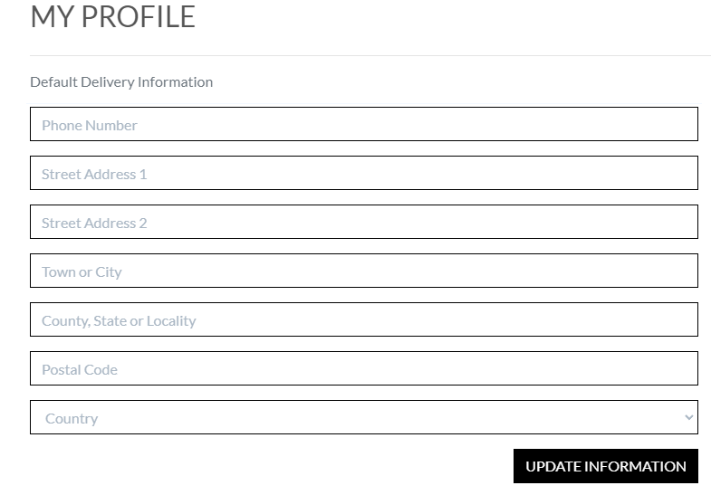
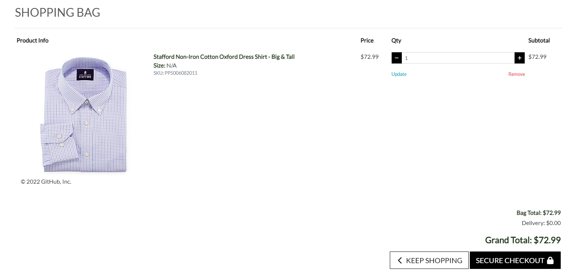

# Green Store

## Features

### Existing features

- Navigation bar
   - In the navigation bar you have the option to register/login to the page and use the search function to search for products.

- Profile page
   - On the profile page you have the ability to change your delivery information and see your order history on the right side.

- Shopping bag
   - In the shopping bag you can update and remove products.

## Testing
- I tested that this page works in different browsers: Opera, Chrome, Microsoft Edge
- I confirmed that this project is responsive. looks good and functions on all standard screen sizes using the devtools device toolbar.

### Validator test

- CSS
   - No errors were returned when passing through the official (Jigsaw) validator.

## Deployment

- The site was deployed to GitHub pages. The steps to deploy are as follows: 
    
    - Log in to GitHub and locate the GitHub Repository
    
    - At the top of the Repository (not top of page), locate the "Settings" Button on the menu.

    - Scroll down the Settings page until you locate the "GitHub Pages" Section.

    - Under "Source", click the dropdown called "None" and select "Master Branch".

    - Once the master branch has been selected, the page will be automatically refreshed with a detailed ribbon display to indicate the successful deployment. 

    - Created an app on Heroku and filled in necessary keys
## Credits

### Media

- The icons were taken from [Font Awesome](https://fontawesome.com/)

- [Bootstrap](https://getbootstrap.com/)

- The posts image is from [Pexels](https://pexels.com)